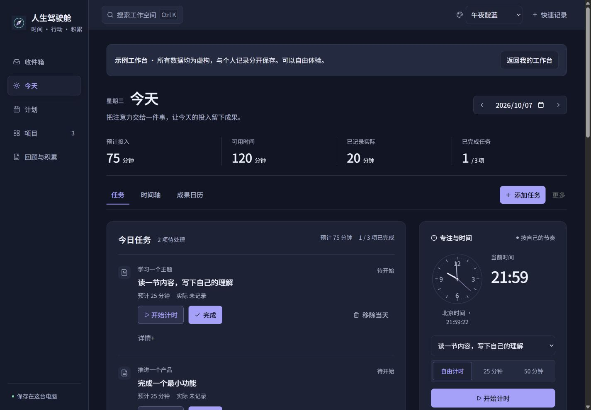

# Life Cockpit

**Turn today's work into visible progress.**

An open-source Windows workspace for independent creators. Plan today's tasks, track the time you actually spend, and review the outcomes you recorded. Core features work offline, with data stored on your computer. No account required.

**[Download for Windows](https://github.com/jsfgmkg95d-source/life-cockpit/releases/tag/v0.14.0-beta.2)** · [Quick start](docs/quickstart.md) · [Report an issue](https://github.com/jsfgmkg95d-source/life-cockpit/issues/new/choose) · [简体中文](README.md)

Windows x64 · Free and open source · MIT · Beta · Primarily Chinese UI

Beta 2 automatically adjusts daily scoring categories and allocations to match your tasks. [Release notes](docs/releases/v0.14.0-beta.2.md)



## A small daily loop

1. Choose a concrete next action for today.
2. Start the timer, do the work, pause to save time, and mark the task complete.
3. Review recorded time and outcomes by project before planning the next week.

Task completion, elapsed time and outcomes remain separate records. Completing a task does not create an outcome automatically. Time spent does not imply quality, income or productivity gains.

## Install

Download the **complete Windows x64 ZIP** from the [Beta release](https://github.com/jsfgmkg95d-source/life-cockpit/releases/tag/v0.14.0-beta.2), extract the entire folder, and launch **人生驾驶舱.exe**. The `Source code` archives are for developers. You do not need Node.js or an API key to run the desktop package.

Create your own workspace or explore synthetic sample projects. The current interface and detailed guide are primarily in Chinese.

## What is included

- Inbox, daily plans, reversible task completion and project records.
- Task timers and a desktop widget.
- Recorded outcomes, project history and reviews.
- Local SQLite storage, manual backups, JSON export and whole-ledger restore.
- Optional online AI summaries through the OpenAI API. Enabling them sends a snapshot of selected records and project information to OpenAI. Core features remain usable without AI. See [privacy details](docs/privacy.md).

This Beta ships for Windows x64. Cloud sync, team collaboration, automatic updates and official macOS, Linux or mobile packages are not currently provided. Back up your data before upgrading. All screenshots use synthetic data.

## Develop

Use Node.js **24.16 or a newer 24.x release** and npm. Desktop builds require Windows x64.

```powershell
git clone https://github.com/jsfgmkg95d-source/life-cockpit.git
cd life-cockpit
npm ci
npm run dev:server
```

In a second terminal, run `npm run dev` and open the local URL it prints.

```powershell
npm test
npm run build
npm run desktop:build
```

Use isolated `PCOS_DATA_DIR` directories for tests. Never test against your daily ledger. Some internal identifiers retain their earlier names for compatibility.

## Contribute

See [contributing](CONTRIBUTING.md) and the [roadmap](docs/roadmap.md). Useful feedback includes your app and Windows versions, reproducible steps, expected behavior and actual behavior. Remove private names, paths and secrets from screenshots; do not upload databases or backups.

Code is licensed under [MIT](LICENSE). Third-party components retain their own licenses; see [third-party notices](THIRD_PARTY_NOTICES.md).
